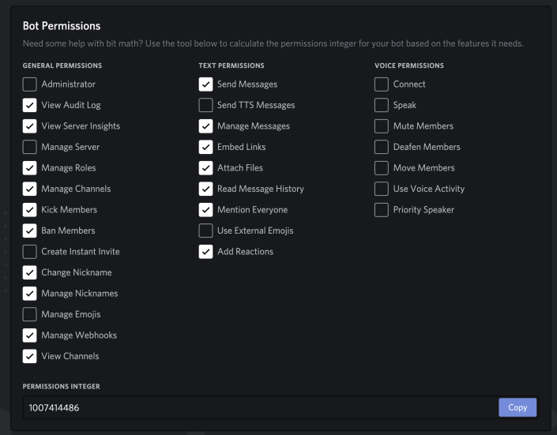

# Installation 

## Requirements

  - Make sure you have node 13+ installed. ```https://nodejs.org/en/download/package-manager/```
  - You will need a MySQL database.  The code has been tested with version 5.7 but likely any modern version should be fine. 

### Javascript Tools

Yarn or NPM is required.  

To install yarn please see this [guide](https://classic.yarnpkg.com/en/docs/install)

or type the command below.

```sh
curl -o- -L https://yarnpkg.com/install.sh | bash
```

## Project Dependencies 

install the package dependencies.  In the project's root folder run one of the following commands:

```
npm install
```

or

```sh
yarn install
```

# Running the Bot

make a copy of config-example.js and update the configuration accordingly.

You will need first to get a token which can be obtained from:

https://discordapp.com/developers/applications


3. Get Token:

https://discordapp.com/developers/applications

Create a new Docker application, Select Bot and grant it the Administrator Role or if you wish to be granular the minimum required list is shown here.



Save the token you'll need it when you configure the bot.

See this [guide](https://discordapp.com/developers/docs/topics/oauth2#bots) for more info.